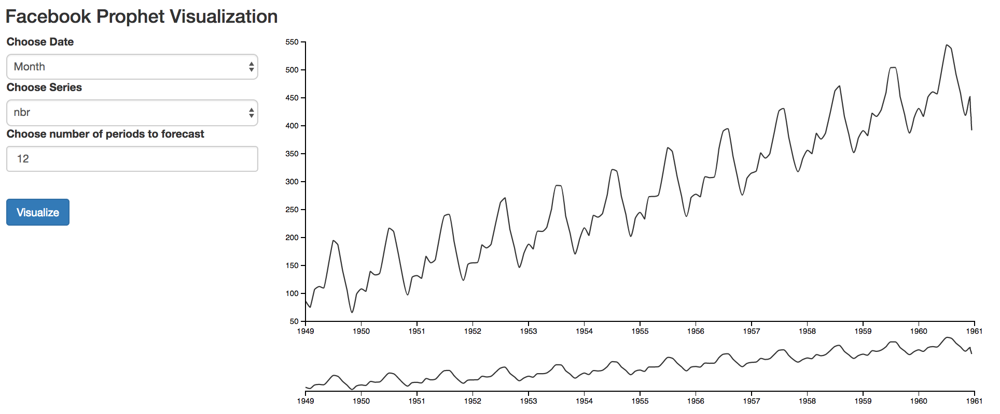

# Simple flask web app to visualize Facebook prophet forecast using d3.js library.

Just experimeting with flask, d3 and FB Prophet (timeseries).
Screen Shot 2017-03-16 at 11.21.41 AM

# d3-timeseries
Time series charting library based on d3.js

## [Examples](http://mcaule.github.io/d3-timeseries/)

